## Custom-Wired-Wireless-Keyboard
      
(Please forgive spelling mistakes, .md is not for the weak)
    
    

## Day 1 (6/25/26) (3 hours)
     
### Idea
     
- My plan is to make a keyboard (obviously), but I want to add wireless connectivity through an ESP32 S2 Mini board instead of the recomended RPI Pico.
     
- Wireless requires power still so I will be implementing a battery (probably 18650) along with a charging module.
     
- Im not certain on size yet. I do like larger keyboards, but that would complicate my design along with the need for space for my extra components.
   
- Extra components: I have an extra 0.96 in oled lying around so I might add that. Additionally I might add an EC11 but im not sure what I would use it for yet.
   
### Progress
    
- For day 1 I first read through the docs then spend the majority of my time researching + adding things to my Ali Express cart.
   
- The first thing I did was create my REPO but I only set it up untill the end with my desired format for my project.
   
### What's Next?
      
- Next up I think im going straight to working on the schematic and then I will see what else I need to do.
     
     

## Day 2 (6/26/26) (1 hour)
     
### Progress
     
- I did not do much this day I just had some free time where I did not feel like playing games so I just tried to find a footprint for the board im using. Long story short It barely exisxts and I suck at downloading stuf from any git platform. Additionally big blunder on me for doing little research, the EPS32 S2 does not feature BLE. Luckily Wemos sells the same footprint board but with and S3 chip and slightly differnt pinnout which I just eddited in KiCad. (Very OP keyboard now IG)
     
### Proof
   
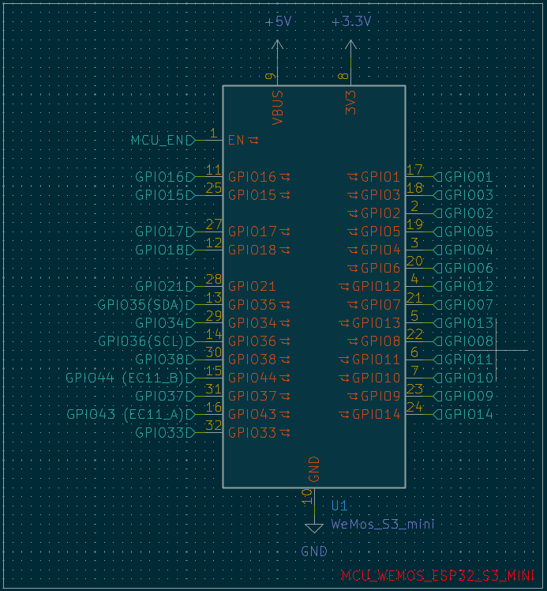
    
    

## Day 3 (7/4/26) (4 hours)
    
### Progress
    
- EC11 Rotary Encoder + SW in schematic. Not 100% sure on use but im thinking cycling through RGB settings. We'll see
- Created Keyboard Matrix file in Hierarchy
- Added pin headder for 4 pin I2C 0.96in OLED
- Added pins for Battery Module (Not yet sure on footprint so will come back)
    
### Proof
    
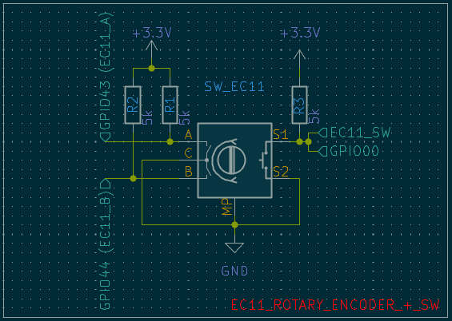
    
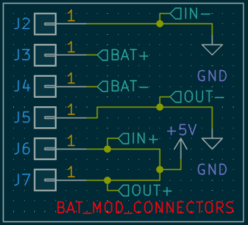
    
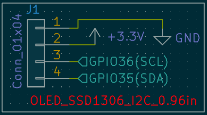

### What's Next?

- Continue working on Matrix

## Day 4 (7/14/26) (4 hours)
    
### Progress
        
- Removed Heirarchical sheets (Had some errors and realized it fit on the main sheet anyways so I just fit it all together)
- Finished Schematic Draft
- Added stabilizers
- Planing Key Layout (used [keyboard-layout-editor](https://www.keyboard-layout-editor.com/). My idea is basically a TKL but without a few of the extra keys to the side that i litterally never use in order to get space for the rest of my components)
    
### Proof
       
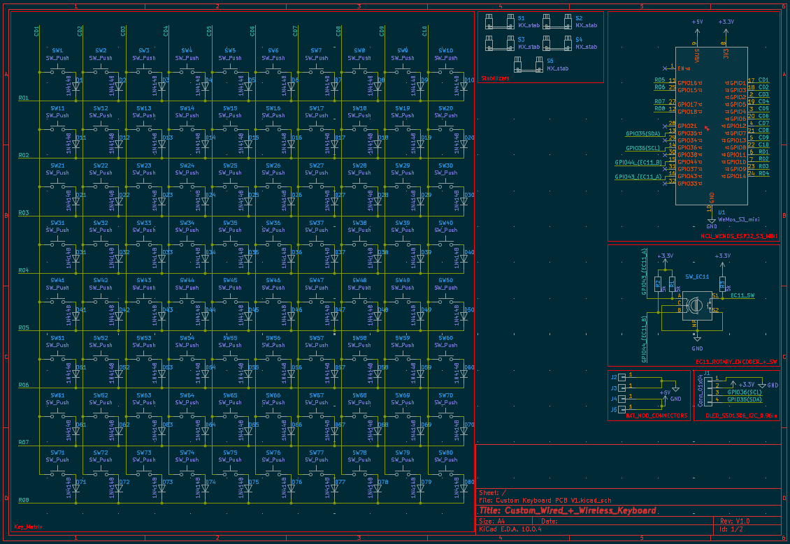
      
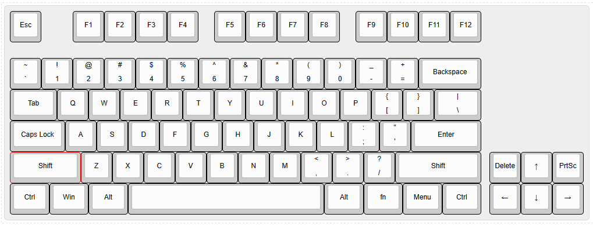
      
### What's Next?
      
- Review Schematic
- Finalize Footprints
- Beging PCB Layout
      
## Day 5 (8/5/26) (4 hours)
      
### Progress
      
- I figured out how I will lay out the keys. Originally I was lost, I tried a few methods but ended up getting stuck at different points both with my lack of experience with kicad's ackwardness with moving components sometimes and kind of not understanding / wanting to use automatic layout tools. After all that I just decided I would layout manually by first laying out the keys in the pattern I desired and then coming back to propperly space them. Basically for spacing I set set my spacing to 19.05mm and for keys that were not 1u I used (shift+p) or (Right click > Positioning Tools > Position Relative to Reference Item) then hit "Select Point..." to my reference switch and spaced it out as 19.05mm for 1u or the (u size of the key + 1u (key size)) / 2 x 19.05 for bigger keys, and then angle is the direction. Example for 1.5u key = ((1.5u + 1u) / 2) x 19.05 = 1.25
      
### Proof
      
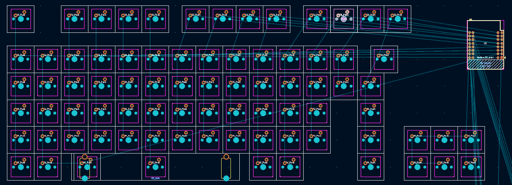
      
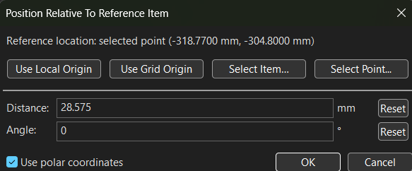
      
### What's Next?
      
- Finish switch layout and the rest of my placements before wiring the pcb
    
     
## Day 6 (Compilation of multiple days that I forgot to update jurnal for)
       
### Progress
      
- Finished key layout, diode placement, and all of the wire routing. So basically I am done with the PCB
Did not end up going for the LED's. I left it for the side for too long and now to go back would be a very long process and I need to get this project done soon.
      
### Proof
      
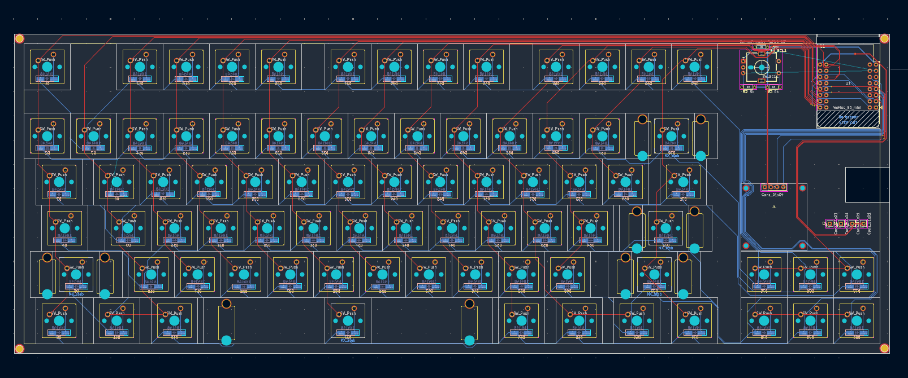
      
### What's Next?
      
- Case CAD
       
        
## Day 7 (9/26/26) (>4 hours)
       
### Progress
      
- CAD :(  I got the case mostly done. + I fixed some mistakes on the PCB (GND fill was not set to connect to the GND pads)
      
### Proof
      
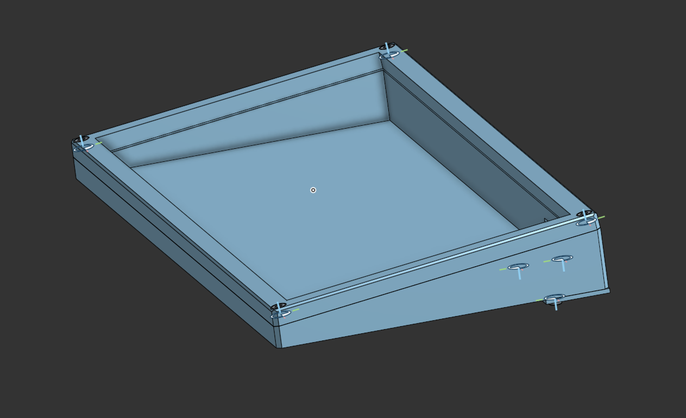
      
### What's Next?
      
- I will soon realize the Plate is wrong for the cad and that will kind of ruin my day so I will stop and come back the next day to fix it

## Day 8 (9/27/26) (3 Hours)
       
### Progress
      
- I do not have enough time to redo the plate (keeb done in 3 days) in the cad so the plan is to skip the plate and use the PCB as the plate (realistically will be more stable than the 1.5mm PLA plate)
        
- Also Vibecoded some of the code for the keyboard (I am 100% certain it will not work and I will have to come back to fix it so wtvr i just need to submit)
       
- Also updated BOM
      
### Proof
      
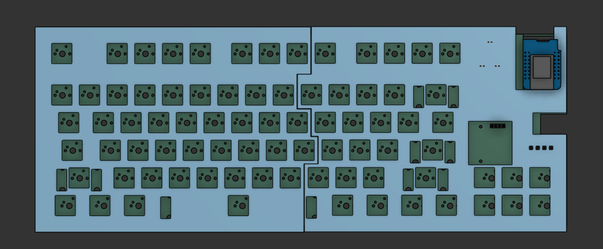
     
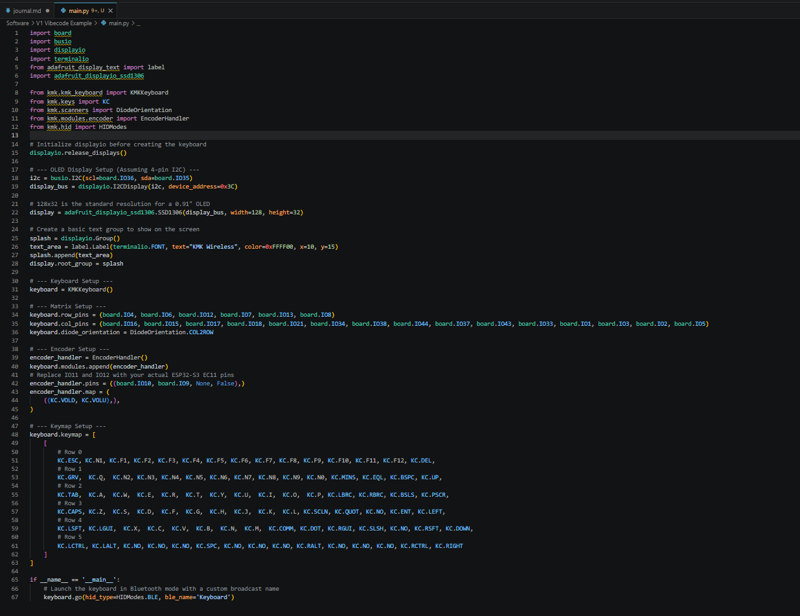
      
### What's Next?
      
- Fix CAD
      
      
## Day 9 (9/28/26) (3 Hours)
       
### Progress
      
- CAD fixed and complete
       
- Also updated BOM
      
### Proof
       
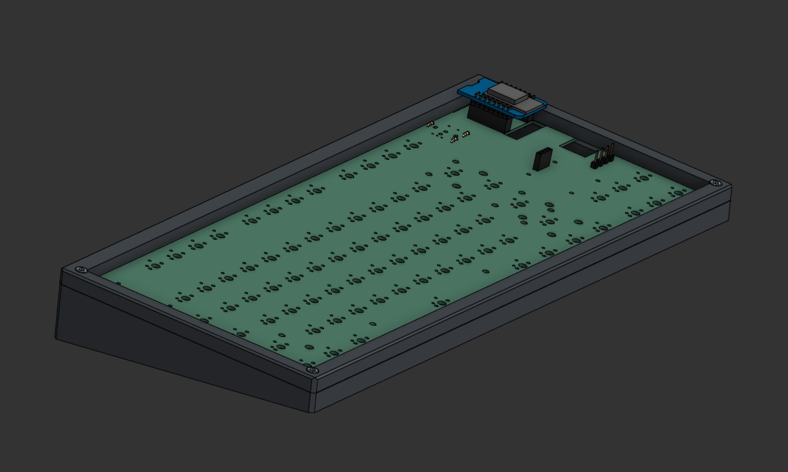
            
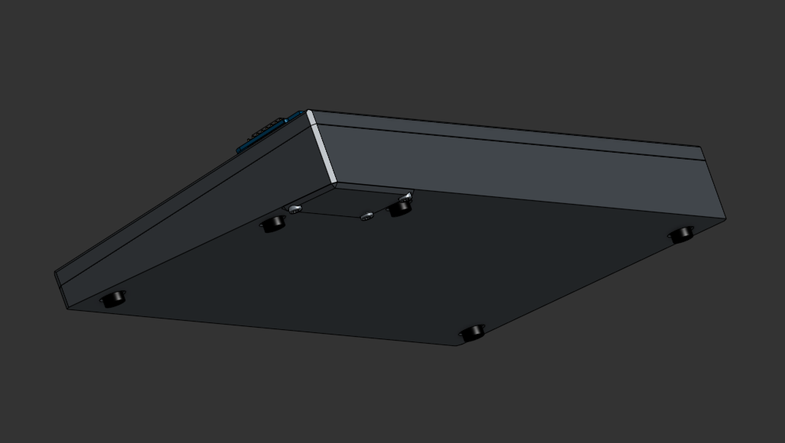
       
### What's Next?
      
- SUBMIT SUBMIT SUBMIT SUBMIT (Obv review first)